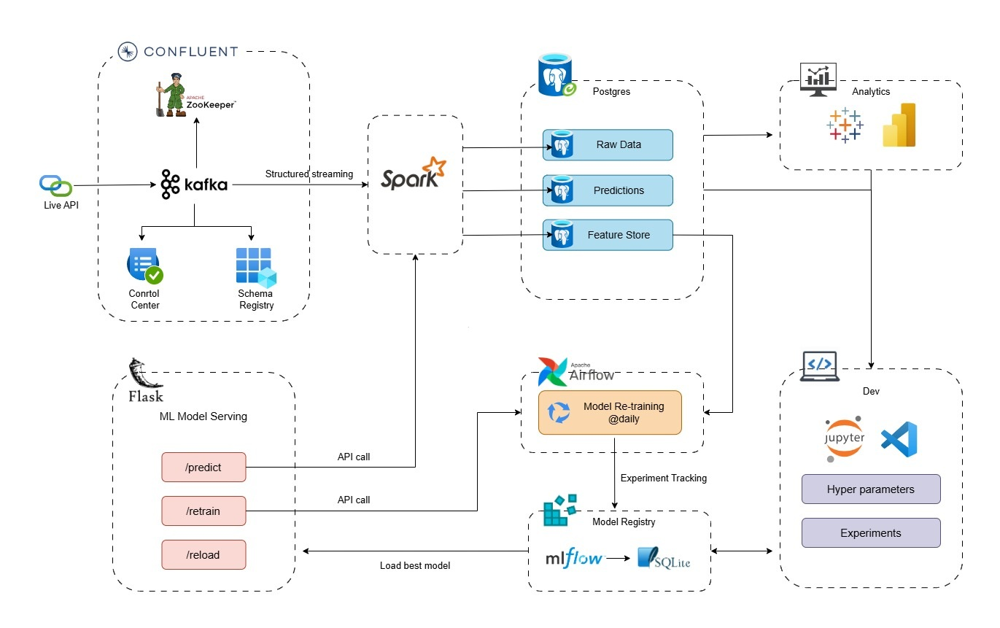

# Data Flow Management System

## Introduction
The Data Flow Management System is a robust platform designed to automate and streamline data workflows. It leverages Apache Airflow for workflow orchestration, Kafka for real-time data streaming, and PostgreSQL for data storage. This system is ideal for organizations looking to enhance their data processing capabilities and ensure seamless data integration.

## Objectives
- Automate data workflows to reduce manual intervention.
- Ensure real-time data processing and streaming.
- Provide a scalable and reliable data management solution.
- Facilitate easy integration with various data sources and sinks.

## Technical Architecture
The system is built using a microservices architecture, with the following components:



- **Apache Airflow**: Orchestrates and schedules data workflows.
- **Kafka**: Handles real-time data streaming and messaging.
- **PostgreSQL**: Stores metadata and configuration data.
- **Prometheus**: Monitors system performance and health.

## Technologies Used
- **Apache Airflow**: For workflow orchestration.
- **Kafka**: For real-time data streaming.
- **PostgreSQL**: For data storage.
- **Prometheus**: For monitoring and alerting.
- **Docker**: For containerization and easy deployment.

## Installation Steps
1. **Clone the Repository**:
   ```bash
   git clone https://github.com/MOHAMED-EL-HADDIOUI/Data-Flow-Management-System.git
   cd Data-Flow-Management-System
   ```

2. **Install Dependencies**:
   ```bash
   pip install -r requirements.txt
   ```

3. **Set Up Docker**:
   Ensure Docker and Docker Compose are installed on your system.

4. **Run the Project**:
   ```bash
   docker-compose up -d
   ```

5. **Access the Airflow UI**:
   Open your browser and navigate to `http://localhost:8080`.

## Usage Instructions
- **Creating Workflows**: Use the Airflow UI to create and manage workflows.
- **Monitoring**: Use Prometheus to monitor system performance and health.
- **Data Streaming**: Configure Kafka topics for real-time data streaming.

## Recommendations and Future Improvements
- **Scalability**: Consider scaling the system to handle larger data volumes.
- **Security**: Implement additional security measures to protect sensitive data.
- **Integration**: Explore integration with more data sources and sinks.
- **User Interface**: Enhance the user interface for better usability.

## License
This project is licensed under the MIT License. See the [LICENSE](LICENSE.txt) file for details.

